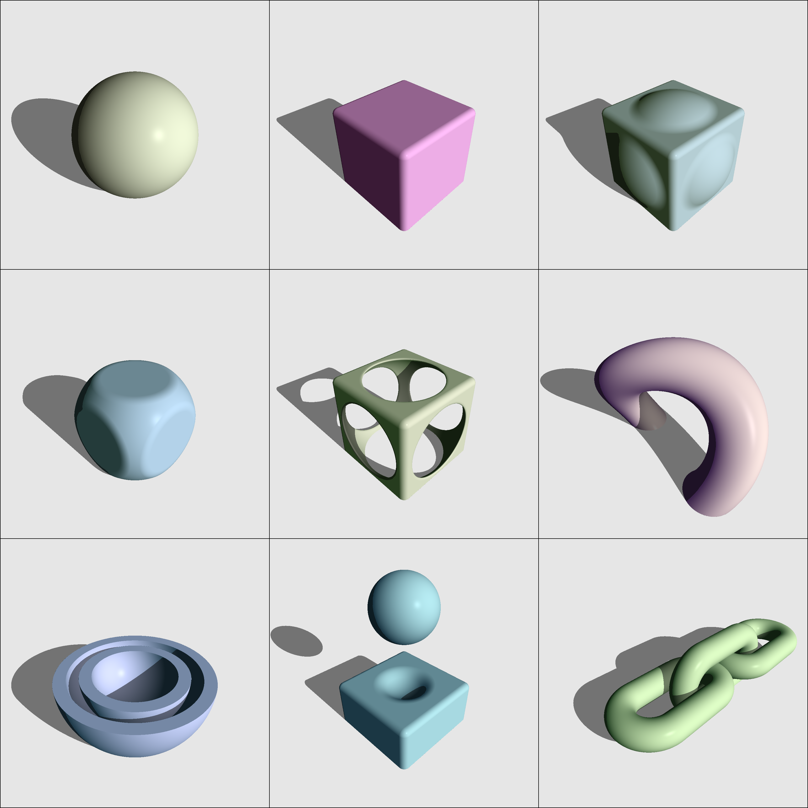

# Torch Sphere Tracer

PyTorch implementation of differentiable Sphere Tracing / Ray Marching with SDFs (Signed Distance Function) and CSG (Constructive Solid Geometry).

## Rendering Results of Constructive Solid Geometry
